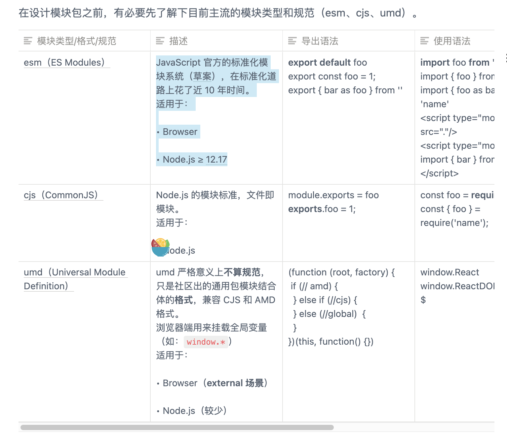

# mocha-design

模块类型

CJS
AMD
CMD
UMD
ESM



共享配置模块（前后端）

1.pnpm init

changesets

```bash
pnpm add @changesets/cli -Dw
```

```bash
pnpm changeset init
```

[pnpm官网](https://pnpm.io/using-changesets)

.npmrc
editorconfig

ESLint + Prettier + husky + lint-staged+Commitizen

```bash
 pnpm add eslint -Dw
 pnpm add prettier -Dw

```

Turborepo Design System starter with Changesets
This is an official React design system starter powered by Turborepo. Versioning and package publishing is handled by Changesets and fully automated with GitHub Actions.

Using this example
Run the following command:

npx create-turbo@latest -e with-changesets
What's inside?
This Turborepo includes the following:

Apps and Packages
docs: A placeholder documentation site powered by Next.js
@acme/core: core React components
@acme/utils: shared React utilities
@acme/tsconfig: shared tsconfig.jsons used throughout the monorepo
eslint-config-acme: ESLint preset
Each package and app is 100% TypeScript.

Utilities
This Turborepo has some additional tools already setup for you:

TypeScript for static type checking
ESLint for code linting
Prettier for code formatting
Useful commands
yarn build - Build all packages and the docs site
yarn dev - Develop all packages and the docs site
yarn lint - Lint all packages
yarn changeset - Generate a changeset
yarn clean - Clean up all node_modules and dist folders (runs each package's clean script)
Changing the npm organization scope
The npm organization scope for this design system starter is @acme. To change this, it's a bit manual at the moment, but you'll need to do the following:

Rename folders in packages/\* to replace acme with your desired scope
Search and replace acme with your desired scope
Re-run yarn install
Versioning and Publishing packages
Package publishing has been configured using Changesets. Please review their documentation to familiarize yourself with the workflow.

This example comes with automated npm releases setup in a GitHub Action. To get this working, you will need to create an NPM_TOKEN and GITHUB_TOKEN in your repository settings. You should also install the Changesets bot on your GitHub repository as well.

For more information about this automation, refer to the official changesets documentation

npm
If you want to publish package to the public npm registry and make them publicly available, this is already setup.

To publish packages to a private npm organization scope, remove the following from each of the package.json's

- "publishConfig": {
- "access": "public"
- },
  GitHub Package Registry
